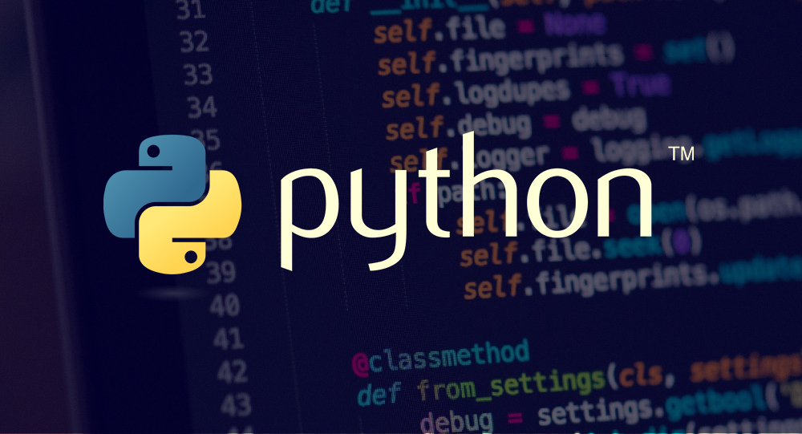

# QuantumCore - graphic Engine
###### _Just **PyQC**_
\
ㅤ
Game Engine in Python ( **[Pygame](https://pypi.org/project/pygame/), [OpenGL](https://www.opengl.org/)**, _[Bullet Physics](https://pybullet.org/wordpress/), [Cython](https://cython.org/)_ ) \
ㅤㅤㅤ
\
ㅤ
## Engine
The main language of the engine is **Python**, it is used to initialize _[VBO](graphic/vbo.py), [CAMERA](graphic/camera.py), [LIGHT](graphic/light.py)_ and transfer values to program shader\
Second language is **OpenGL**, or just **GLSL**, he used in `.frag` and `.vert` shaders, example: [main.frag](graphic/shaders/automaton/unilight.frag) and [main.vert](graphic/shaders/automaton/unilight.vert) _(last versions)_. It`s help me use your GPU\
Other modules using languages are also initialized.\
For example:
- `PyBullet` - **C++**;\
- `PyGame` - **C**;\

To calculate complex formulas in the engine, the `Cython` plugin and the **C** language are used the [error screen](err_screen) is available to the user, which will appear if one occurs

### requirements:
- standard modules
  * sys;
  * os;
  * glob;
  * time;
- frameworks
  * PyGame;
  * ModernGL;
  * Numpy;
  * PyGlm;
  * Bullet Physics;
  * PyWaveFront;
  * PyAssimp; \

## COMPILE:
Compile command: `pyinstaller --name "Quantum Game v0.3.2" --icon="QuantumCore/data/QuantumCore_ico.ico" --add-data "C:/Program Files/Python311/Lib/site-packages/moderngl;moderngl" --add-data "C:/Program Files/Python311/Lib/site-packages/glcontext;glcontext" --add-data "F:/project/QuantumCore/core/elements/entities.py;entities" main.pyw`\
After compile - copy all data in directory (textures, models, game data and other)

### Project language structure:

> main&IO ( Python ) -> | CPU ( C ) - Cython\
> ㅤ\/ ㅤㅤㅤㅤㅤㅤㅤㅤ | modules ( C++ )\
>  GPU ( Open GL )

### Project structure:
\
ㅤ

#### screenshots:
> 1. light: [after add 2 and more light source](data/Screenshots/intermediateV1.png);
> 2. model loader: [3 loaded models in scene](data/Screenshots/model_loader.png);
> 3. Easy API: [add models and textures, create window and rewrite scene](data/Screenshots/easy_api.png), [using "Builder" and load xml file](data/Screenshots/easy_api2.png)\
